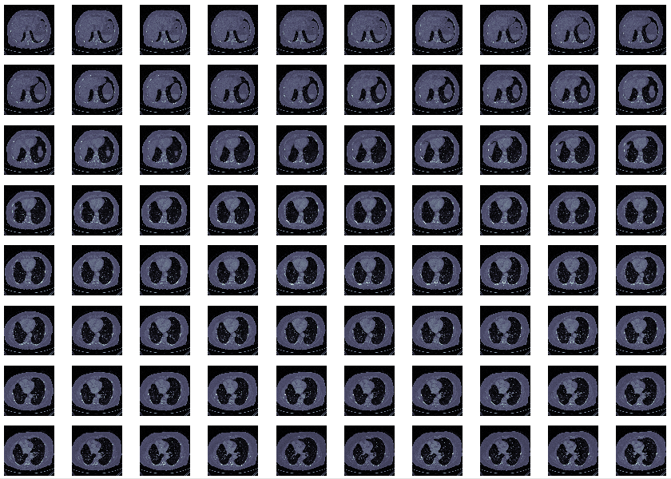
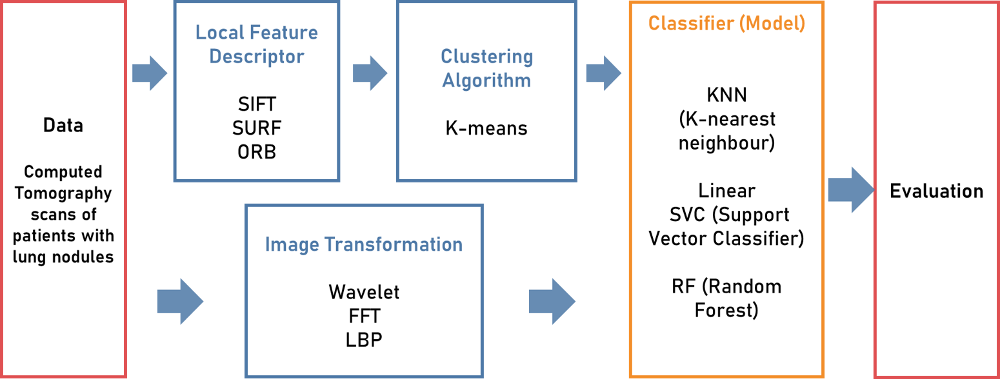
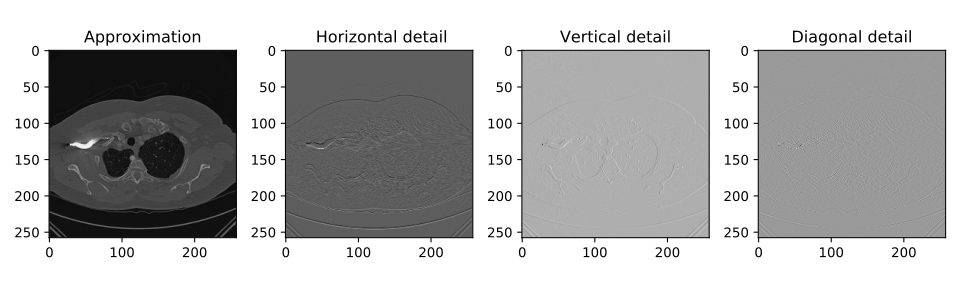
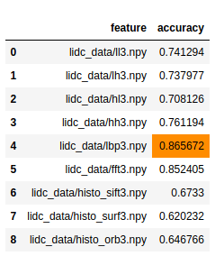
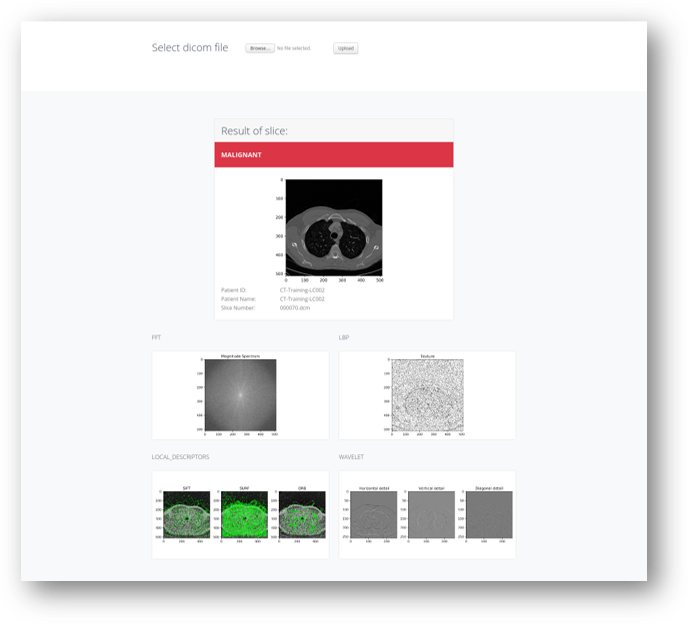

# lung-cancer-image-classification
Lung cancer image classification in Python using LIDC dataset. Images are processed using local feature descriptors and transformation methods before input into classifiers.

## Project Objective
- To identify the best local feature extraction and image transformation method for lung cancer image classification
- To develop a model for lung cancer classification
- To develop a prototype of image classification tool to categorize malignant and benign lung nodules

### Methods Used
* Image Transformation
* Dimensionality Reduction
* Machine Learning

### Technologies
* Python
* Python scikit-learn
* Python pandas, flask
* Jupyter

## Project Description
* `config.py` - global variables
* `preporcessing.py` - preprocessing methods
* `image_processing.py` - image transformations methods
* `import_data.py` - read and convert raw data
* `data_lidc.py` - generates features from LIDC dataset
* `main.py` - train models
* `Models Comparison.ipynb` - models comparison

Data source from [cancerimagingarchive.net](https://wiki.cancerimagingarchive.net/display/Public/LIDC-IDRI) consists of 1018 labelled CT scans cases.

|  | 
|:--:| 
| *Dataset CT scan slices.* |

Data from dicom format is read into array.

|  | 
|:--:| 
| *Flow of data to classifiers.* |

K-means algorithm is used to group features extracted from images. Images transformed are directly fed into classiifers. A comparison is made for the each local feature descriptors and image transformation methods in the diagram.

|  | 
|:--:| 
| *One example of image transformations, wavelet tranform.* |

|  | 
|:--:| 
| *Best accuracy obtained after 3rd wavelet transformation and LBP clustering* |

|  | 
|:--:| 
| *Screenshot of flask app running.* |

## Process Flow
- frontend development
- data collection
- data processing/cleaning
- image transformation
- model training
- writeup/reporting

## Future Improvements
This is my first time experimenting on a large dataset. Make use of data pipeline for clean and reusable codes. Try on hadoop to handle insufficient memory.
